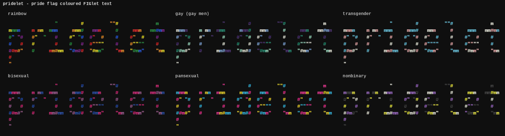

# pridelet

A fork of [TOIlet](http://libcaca.zoy.org/toilet.html) that renders text using FIGlet fonts with pride flag colours. This is the pridelet version.



## Dependencies

- [libcaca](http://libcaca.zoy.org/) >= 0.99.beta18
- [json-c](https://github.com/json-c/json-c) >= 0.12
- A C compiler, make, and autotools (autoconf, automake)

## Build & Install

```sh
./bootstrap
./configure
make
sudo make install
```

To build without installing, run from the project root:

```sh
./src/pridelet -d fonts [options] "text"
```

## Usage

```sh
pridelet [option...] [message]
```

Read from stdin:

```sh
echo "Hello World" | pridelet --rainbow
```

Pass text as arguments:

```sh
pridelet --gay "pridelet"
```

### Flag colour options

| Option | Description |
|--------|-------------|
| `--rainbow` | Rainbow pride flag |
| `--gay` | Gay men pride flag |
| `--transgender` | Transgender pride flag |
| `--flag <name>` | Any flag from `colors.json` |
| `--flag list` | List all available flags |

### Other options

| Option | Description |
|--------|-------------|
| `-f, --font <name>` | Select a font (default: ascii9) |
| `-d, --directory <dir>` | Font directory |
| `-w, --width <width>` | Output width |
| `-t, --termwidth` | Use terminal width |
| `-F, --filter <filter>` | Apply a filter (`-F list` to list) |
| `--metal` | Metallic colour effect |
| `-E, --export <format>` | Export format (utf8, html, irc) |
| `--html` | Export as HTML |
| `--irc` | Export as IRC colours |

### Examples

```sh
# Rainbow flag
pridelet --rainbow "Hello World"

# Gay men pride flag
pridelet --gay "Love is Love"

# Any flag from colors.json
pridelet --flag bisexual "Pride"
pridelet --flag lesbian "Pride"
pridelet --flag pansexual "Pride"

# Combine with filters
pridelet --rainbow -F border "Welcome"
```

## Adding flags

Edit `colors.json` and add a new entry with a name and hex colour array. The new flag is immediately available via `--flag <name>` — no recompilation needed.

```json
{
  "my-flag": ["#FF0000", "#00FF00", "#0000FF"]
}
```

## License

WTFPL — see [COPYING](COPYING).

---

Made by [SignalDirective](https://signaldirective.github.io) · [Support on Ko-fi](https://ko-fi.com/signaldirective)
