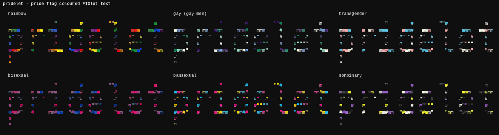

# pridelet

A fork of [TOIlet](http://libcaca.zoy.org/toilet.html) that renders text using FIGlet fonts with pride flag colours.

pridelet is more than just a pride flag fork of TOIlet: it implements the FIGlet features that TOIlet never got around to porting. Among other things, it adds control files, right-to-left printing, vertical smushing, paragraph mode, layout modes, word wrapping and justification — features from the FIGlet specification that were missing in TOIlet.



## Dependencies

- [libcaca](http://libcaca.zoy.org/) >= 0.99.beta18
- [json-c](https://github.com/json-c/json-c) >= 0.12
- A C compiler, make, and autotools (autoconf, automake)

## Build & Install

```sh
./bootstrap
./configure
make
sudo make install
```

To build without installing, run from the project root:

```sh
./src/pridelet -d fonts [options] "text"
```

## Usage

```sh
pridelet [option...] [message]
```

Read from stdin:

```sh
echo "Hello World" | pridelet --rainbow
```

Pass text as arguments:

```sh
pridelet --gay "pridelet"
```

### Flag colour options

| Option | Description |
|--------|-------------|
| `--rainbow` | Rainbow pride flag |
| `--gay` | Gay men pride flag |
| `--transgender` | Transgender pride flag |
| `--flag <name>` | Any flag from `colors.json` |
| `--flag list` | List all available flags |

### Font and rendering options

| Option | Description |
|--------|-------------|
| `-f, --font <name>` | Select a font (default: ascii9) |
| `-d, --directory <dir>` | Font directory |
| `-w, --width <width>` | Output width |
| `-t, --termwidth` | Use terminal width |
| `-s, -S, -k, -W, -o` | Render mode (default, force smushing, kerning, full width, overlap) |
| `-m, --layout <mode>` | Layout mode by number (`-1`, `0`, `1`, `2`, `-2`) or name (`default`, `full`, `kern`, `smush`, `overlap`) |
| `-V, --vertical-smush` | Smush successive output lines vertically |

### Text layout options

| Option | Description |
|--------|-------------|
| `-p, --paragraph` | Paragraph mode: reflow paragraphs, blank lines separate them |
| `-n, --normal` | Normal mode (default): every newline produces a line break |
| `--word-wrap` | Wrap output at word boundaries (implied by `-p`) |
| `--justify <mode>` | Justify text: `left`, `center`, or `right` |
| `-L, --left-to-right` | Print text left-to-right |
| `-R, --right-to-left` | Print text right-to-left |
| `-X, --default-direction` | Use the print direction stored in the font file (default) |

### Control files

| Option | Description |
|--------|-------------|
| `-C, --controlfile <file>` | Add a `.flc` control file (character mapping table) |
| `-N, --nocontrolfiles` | Clear the control file list |

### Filters and export

| Option | Description |
|--------|-------------|
| `-F, --filter <filter>` | Apply a filter (`-F list` to list) |
| `--metal` | Metallic colour effect |
| `-E, --export <format>` | Export format (utf8, html, irc) |
| `--html` | Export as HTML |
| `--irc` | Export as IRC colours |
| `-h, --help` | Display help |
| `-I, --infocode <code>` | Print a FIGlet-compatible infocode |
| `-v, --version` | Output version information |

The `pride` filter applies the currently selected pride flag palette (via `--flag`, `--rainbow`, etc.). Used on its own, e.g. `-F pride`, it defaults to the rainbow flag.

## Features added over TOIlet

These are the FIGlet features that TOIlet never implemented, now available in pridelet:

### Word wrapping and justification

Wrap long text at word boundaries and align it left, center or right.

```sh
pridelet --word-wrap --justify center "Long text that needs word wrapping"
pridelet --word-wrap --justify right -w 60 "Right aligned and wrapped"
```

### Paragraph mode (`-p` / `-n`)

In paragraph mode, line breaks within a paragraph are treated as blanks between words, and each paragraph is reflowed to fit the output width. A blank line separates paragraphs. This is ideal when piping a multi-line file through pridelet:

```sh
printf "This is a long paragraph\nthat will be reflowed.\n\nSecond paragraph.\n" | pridelet -p
```

`-n` switches back to normal mode, where every newline produces a line break.

### Layout modes (`-m`)

Select how adjacent FIGcharacters are spaced, either by number or by name, the FIGlet way:

```sh
pridelet -m 1 Hello      # kerning (same as -k)
pridelet -m 2 Hello      # smushing (same as -S)
pridelet -m full Hello   # full width (same as -W)
pridelet -m -1 Hello     # default (use the font's own layout)
```

### Control files (`-C` / `-N`)

Control files are `.flc` mapping tables that translate input characters into font character codes, similar to the Unix `tr` command. They are used to support character sets other than Latin-1 — for example the ISO Latin-2 through Latin-5 sets, Hebrew, katakana, Cyrillic or UTF-8.

```sh
pridelet -C 8859-2 -f standard < latin2.txt
pridelet -C ilhebrew -f ivrit shalom
```

Control files support single character translations, ranges, and multiple transformation stages separated by `f` commands. See the man page (`man pridelet`) for the full format.

### Right-to-left printing (`-L` / `-R` / `-X`)

Print each output line right-to-left, for scripts such as Hebrew and Arabic:

```sh
echo "shalom" | pridelet -R -f ivrit
```

`-L` forces left-to-right, `-R` forces right-to-left, and `-X` (the default) uses the print direction stored in the font file.

### Vertical smushing (`-V`)

When a paragraph or word-wrapped text wraps over several output lines, `-V` smushes them together vertically using the font's vertical smushing rules (equal character, underscore, hierarchy, horizontal line, and vertical line supersmushing). Fonts that enable vertical smushing in their layout parameter use it automatically.

```sh
printf "This is a long paragraph that will be reflowed and smushed vertically." | pridelet -p -V
```

## Examples

```sh
# Rainbow flag
pridelet --rainbow "Hello World"

# Gay men pride flag
pridelet --gay "Love is Love"

# Any flag from colors.json
pridelet --flag bisexual "Pride"
pridelet --flag lesbian "Pride"
pridelet --flag pansexual "Pride"

# Combine with filters
pridelet --rainbow -F border "Welcome"

# Word wrapping and justification
pridelet --word-wrap --justify center "Long text that needs word wrapping"
pridelet --word-wrap --justify right -w 60 "Right aligned and wrapped"

# Paragraph mode with vertical smushing
printf "Paragraph one.\n\nParagraph two.\n" | pridelet -p -V

# Right-to-left
echo "ABC" | pridelet -R

# Control files
pridelet -C tolower "HELLO"
```

## Adding flags

Edit `colors.json` and add a new entry with a name and hex colour array. The new flag is immediately available via `--flag <name>` — no recompilation needed.

```json
{
  "my-flag": ["#FF0000", "#00FF00", "#0000FF"]
}
```

## Credits

pridelet would not exist without the work of those who came before it.

It is a fork of **TOIlet** ("The Other Implementation's Letters"), written by [Sam Hocevar](https://sam.zoy.org/) as part of the [libcaca](http://libcaca.zoy.org/) project. TOIlet provides the rendering engine, the `.tlf` font format, and the overall program architecture that pridelet builds on. Without the TOIlet developers and the libcaca library there would be no pridelet. See the [TOIlet project page](http://libcaca.zoy.org/toilet.html) and the [libcaca project](http://libcaca.zoy.org/).

The FIGlet features implemented here follow the **FIGlet** standard. FIGlet was written by Glenn Chappell, Ian Chai and Frank, with major contributions from John Cowan, Paul Burton and Claudio Matsuoka, and the FIGfont specification by John Cowan and Paul Burton defines the font and control file formats, the layout modes, and the smushing rules that pridelet implements. See the [FIGlet project page](http://www.figlet.org/).

Special thanks to all of them for their freely available and liberally licensed work.

## License

WTFPL — see [COPYING](COPYING).

---

Made by [SignalDirective](https://signaldirective.github.io) · [Support on Ko-fi](https://ko-fi.com/signaldirective)
